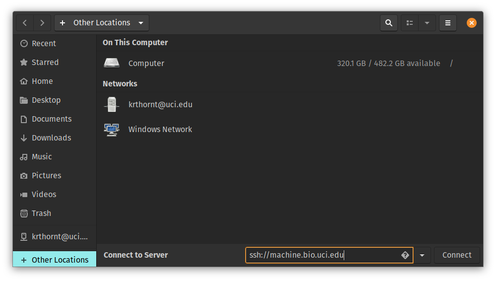
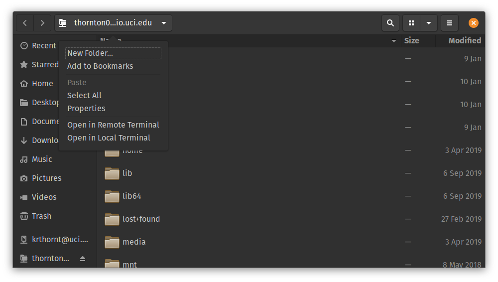

# "Mounting" a remote file system

The information in this section is quite biased towards Linux machines and/or Windows machines using the Ubuntu subsystem.

It is sometimes useful to access a remote file system as if it were local.
To do so, we need to "mount" the remote file system, which basically means to assign it to a local folder.
Once that is done, navigating around that local folder is in fact moving around the remote file system.

## Using sshfs

The command line program `sshfs` can be used to mount file systems from remote Unix machines.
For this to work, you need a local folder that you own.
This folder will be the mount point for your remote file system.
For this example, we will use `$HOME/sshfs` as that local folder:

```sh
mkdir ~/sshfs
```

Then, to mount a remote file system:

```sh
sshfs ~/sshfs user@machine.domain:
```

The `:` at the end tells `sshfs` to mount the home folder associated with `user` on the remote machine.
Once you are authenticated, you may navigate onto the remote file system:

```sh
cd ~/sshfs
```

If you don't want to mount the remote account's home folder, then specify the path explicitly when making the connection.
For example, to mount the root of the file system (the `/` folder):

```sh
sshfs ~/sshfs user@machine.domain:/
```

To remove the remote mount, use the `umount` command:

```sh
umount ~/sshfs
```

If you find yourself needing to mount *multiple* remote file systems, then you need *multiple local folders*.
For example:

```sh
mkdir ~/sshfs/workstation
mkdir ~/sshfs/cluster
sshfs ~/sshfs/workstation user@workstation.bio.uci.edu:
sshfs ~/sshfs/cluster user@cluster.uci.edu:
```

Now, you can do things like copy files between the two machines.
(Arguably, though, there are better ways to do such copies.)
The unmounting is as before:

```sh
umount ~/sshfs/workstation
umount ~/sshfs/cluster
```

## Using the GNOME file manager

Via the "Other Locations" button on the left, add a remote server via the form `ssh://machine.domain":



Hit `Enter/Return` and you'll be asked to authenticate.

Once you have a connection, you can open a remote or local terminal to that server:



The `local` terminal opens up a terminal in the directory containing the mount point of the remote server.
This `local` terminal can be useful for editing files on the remote server, but it may be a bit slow, depending on your editor and/or your connection.
A `remote` terminal opens up a terminal and logs you in to the remote server.

## Advanced topics

The default treatment of things like symbolic links on the remote server may be unintuitive.
If this comes up, search the `man` page for `sshfs` for options affecting the treatment of remote symbolic links.


