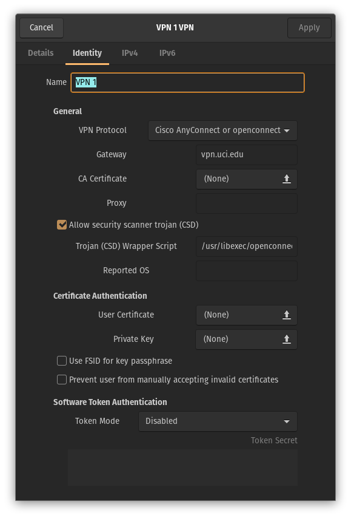

# VPN access to campus resources

If you are traveling, live off campus, etc., then you need to use a VPN to access machines on campus.

The official instructions from `UCI` are [here](https://www.oit.uci.edu/help/vpn/).
In general, prefer the "software VPN" over the "Web VPN".
You may also want to use "UCI full" over just "UCI" when choosing your connection option.
The former gives you better access to things like the library, etc..

## Special notes for Linux users

The official `Cisco` client for the VPN is truly awful.
(This is the tool that `UCI` recommends in the instructions linked to above.)
KT has had much better luck with the `openconnect` VPN on Linux.

To install `openconnect` on your Debian/Ubuntu/PopOS! system:

```sh
sudo apt install network-manager-openconnect-gnome
```

Once installed, you can configure it via the `Settings` graphical interface.

To accommodate the UCI requirement for two-factor authentication:

```sh
locate csd-wrapper.sh
```

Take that path, and add it to the GUI configuration.
An example may look like this:




Even with this, all is not 100% rosy!
KT's experience on PopOS! is:

* On a laptop, the VPN connection may not persist through a sleep/wake cycle.
* Even worse, you may not be able to connect to the internet at all.
* The solution seems to be to reboot, which is quite annoying.

Even with this sleep/wake problem, the experience is still far better than the official `Cisco` client!
